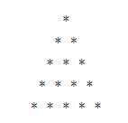

## Basic Programming with JS

### Guidelines:  
* This assignment is mandatory for everyone  
* There will only be a single attempt for each exam and no deadline extension in  case of assignments  
* Any case of unfair means or plagiarism would lead to debarring in final  placements without any further consideration.  
* The images of the applications are only for reference, the app design can be different  but all the components mentioned in the image of the apps should be present.

### Problem 1:-
Write a program in js to print pattern on console?
   

### Problem 2:-
Write a program in js to print fibonacci series upto n terms
where n is the number given by the user?
suppose 

input :- n=8

output:- 1 1 2 3 5 8 13 21

here elements in output is 8 in number.

### Problem 3:-
write a program in js to find the 3rd largest number in an array?

input:- [2,5,22,44,52,65,87,56,98,08]
output:- 65

### Problem 4:- 
write a program in js to find all possible substring of a word?

input:- bye
output:- [b,y,e,by,ye,bye]

### Problem 5:-
write a program in js to find the longest and smallest word in a string?

 input:- 'Jack went to the doctor due to his tooth ache'
 
 output:- longest = doctor
          smallest = to
          
if there are more that 1 smallest word print one that comes first alphabetically eg:

if to and in is there then print 

smallest= in 

as i comes first alphabetically

### Problem 6
write a program in js to sort and string array in alphabetical order

input:[random, people, sometimes, give, the, best, advice]

output:-[advice,best,give,people,random,sometime,the]
